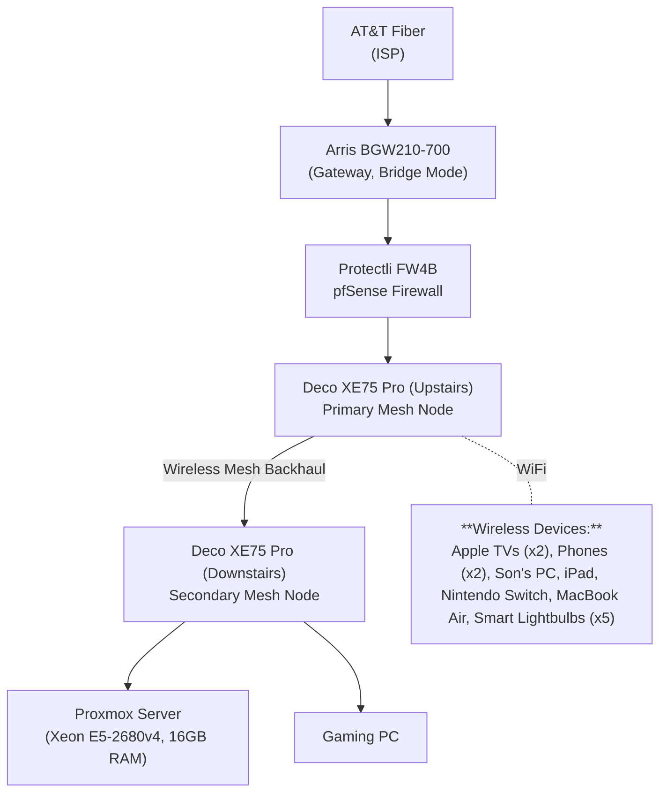

## 📡 Home Network Layout

```mermaid
graph TD
    ISP["AT&T Fiber<br/>(ISP)"] --> Modem["Arris BGW210-700<br/>(Gateway, Bridge Mode)"]
    Modem --> Firewall["Protectli FW4B<br/>pfSense Firewall"]
    Firewall --> DecoPrimary["Deco XE75 Pro (Upstairs)<br/>Primary Mesh Node"]
    DecoPrimary -- "Wireless Mesh Backhaul" --> DecoSecondary["Deco XE75 Pro (Downstairs)<br/>Secondary Mesh Node"]

    %% Wired connections
    DecoSecondary --> Proxmox["Proxmox Server<br/>(Xeon E5-2680v4, 16GB RAM)"]
    DecoSecondary --> GamingPC["Gaming PC"]

    %% Single grouped box for wireless devices
    DecoPrimary -. WiFi .- WirelessGroup["**Wireless Devices:**<br/>Apple TVs (x2), Phones (x2), Son's PC, iPad, Nintendo Switch, MacBook Air, Smart Lightbulbs (x5)"]
```