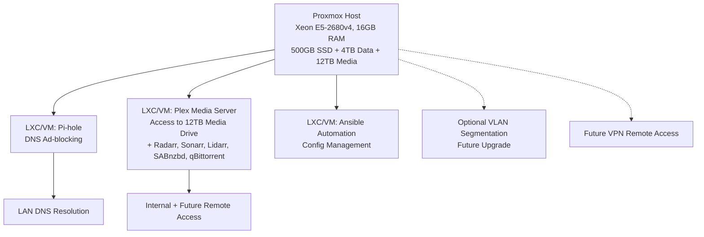

## 🖥️ Proxmox Server Architecture

```mermaid
graph TD
    Proxmox["Proxmox Host<br/>Xeon E5-2680v4, 16GB RAM<br/>500GB SSD + 4TB Data + 12TB Media"]

    %% VM / Container Layout
    Proxmox --> PiHole["LXC/VM: Pi-hole<br/>DNS Ad-blocking"]

    %% Plex VM now includes *arr Suite
    Proxmox --> Plex["LXC/VM: Plex Media Server<br/>Access to 12TB Media Drive<br/>+ Radarr, Sonarr, Lidarr, SABnzbd, qBittorrent"]

    %% Optional future
    Proxmox --> Ansible["LXC/VM: Ansible Automation<br/>Config Management"]
    Proxmox -.-> VLAN["Optional VLAN Segmentation<br/>Future Upgrade"]
    Proxmox -.-> VPN["Future VPN Remote Access"]

    %% Connectivity
    PiHole --> LAN["LAN DNS Resolution"]
    Plex --> RemoteAccess["Internal + Future Remote Access"]
```